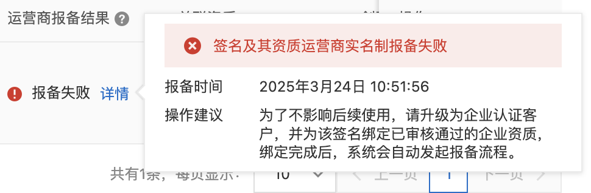
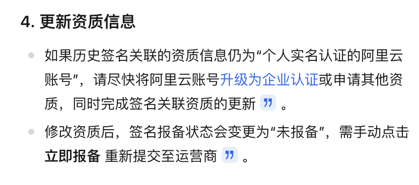
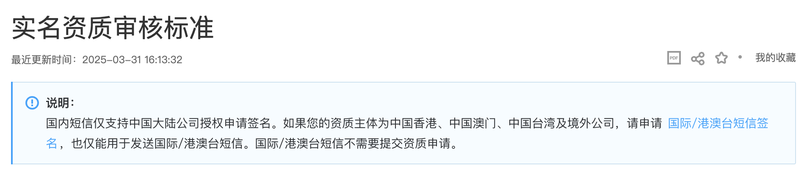
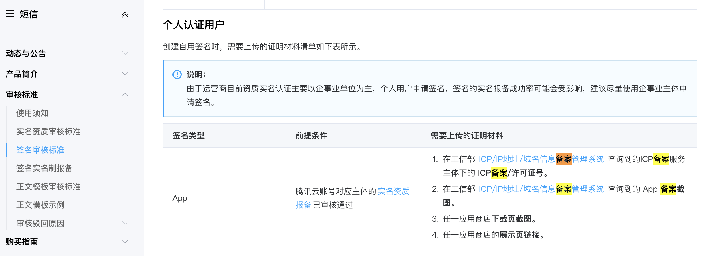

# 国内短信报备取消个人资质

2025年个人创业又增加一条劝退理由：**从4月底开始，短信业务报备取消个人资质**。

有图有真相，贴上从阿里云控制台截屏的信息如下：

Ta荐的用户注册为了把流程简化到极致，设计为使用手机号码+短信验证码的方式注册，在2024年上线的时候就已经成功对接了阿里云的短息业务。

因为没有注册公司，阿里云账号一直使用的个人实名认证的身份，选择阿里云短信业务的原因，也是因为对比了腾讯的短信业务必须要完成网站备案才能对接，
由于服务器选用的阿里云香港服务器，而香港服务器可以无需备案就能配置域名开设网站。

下面来捋一捋Ta荐是怎么一步一步走入今天无法以个人资质完成短信业务报备的现状的：

1. 有创立Ta荐的想法，是否以公司资质来做？

对于多数创业者来说，把一个想法从0-1变成产品，在做之前就会面临这个决策，到底以公司资质来做还是以个人资质来做？

对我而言，Ta荐这个项目短期是没有盈利目标的，注册公司意味着需要按月处理公司相关的事物（如：公司注册、企业开银行账户、财务记账、报税等等），
不但耗费精力还会有资金支出（如果找会计公司做账、报税，每月花费至少200元），所以我选择了个人资质来做。

2. 个人资质开设网站是否完成备案？

这个问题本不是问题，因为对于用户而言，你的网站是否备案不影响他使用网站功能，所以我选择了阿里云香港服务器开架设网站，不备案先上线。

对于网站需要对接一些第三方的业务（如短信业务），国内的云厂商大部分业务都要求网站域名必须备案，阿里云稍微宽松一些，因为它们提供包括香港、新加坡等多地的海外云主机，
如果只从网站域名是否实名角度看，从阿里云等厂商注册环节开始，都是实名认证的，再到域名注册、服务器购买，也都是实名认证的，
也许是短信业务在某些管理部门看来，知道谁在使用还不够，你要进一步完成“资质报备”。

如果回到短信业务对接要求来看，腾讯云在短信签名审核标准中，明确要求提供备案号，阿里云则没有要求。

3. 2025年3月底开始要求短信签名运营商报备

大概在2025年3月24日后面一两天，Ta荐部分用户反馈收不到短信验证码，于是在阿里云控制台看数据，发现提示要求完成短信签名运营商报备，于是操作完成报备提交，
印象一直等待了接近 1 个月时间，阿里云控制台里终于看到报备状态是“通过”，虽然它提示这个状态只表示只少有一个运营商通过了，在测试发送验证码的时候，
我的手机是能正常接收到短信验证码的。

谁曾想没过几天，阿里云控制台再次出现报备失败的提示，原来需要升级阿里云账户为企业账户才能完成短信签名的报备了。

## 结论

2025年开始，如果你想以个人身份创业，请三思而行，因为最终你会发现，有一张错综复杂又看不见的网罩在你的头上，平常不抬头看不见它，而在你想要往上够或者想要飞的时候，它会牢牢地束缚住你，直到你精疲力尽！

最后附上两张腾讯云官方文档关于短信业务资质和短信签名要求的截图：

